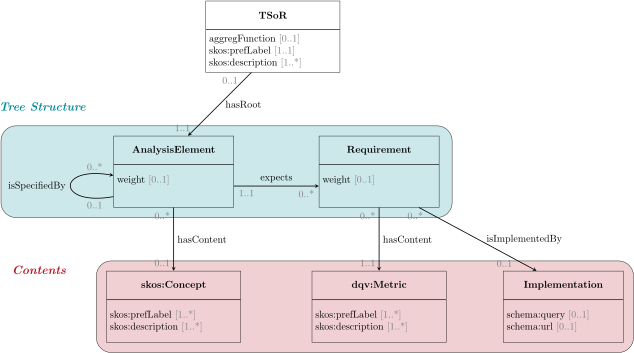

# TSoR-vocab
This document is a vocabulary to describe compound measures, i.e. measures with several metric or item that are organized with serveral dimensions. The description of such a measure relies on a Tree-Structure of Requirement (TSoR): a set of requirements structured hierarchicaly with analysis element. A TSoR represents the main measure. Several information may be added to explicitely indicate how the overall score on the measure should be calculated based on the hierarchy, relative importance of the node of the hierarchy and an aggregation function. The measure can be described completely and unambiguously from the organisation to the requirements and the implementation.

The vocabulary is defined as follows.

To see the human-readable version of this vocabulary, [click here](https://w3id.org/lode/owlapi/https://raw.githubusercontent.com/Jendersen/TSoR-vocab/main/cmd_vocab.xml).
The vocabulary is available in two formats: [RDF/XML](cmd_vocab.xml) or [Turtle](cmd_vocab.ttl).

## To go further
[SHACL shapes](cmd_shacl.ttl) are defined to ensure that the TSoR define with the vocabulary is well-formed, i.e. it actually forms a tree structure. It also verify that the TSoR satisfies some recommendations.
The file [example.ttl](example.ttl) provides an example of a TSoR defined with the given vocabulary. It represents a measure of accountability, as describe in [here](https://github.com/Jendersen/KG_accountability/tree/main).
